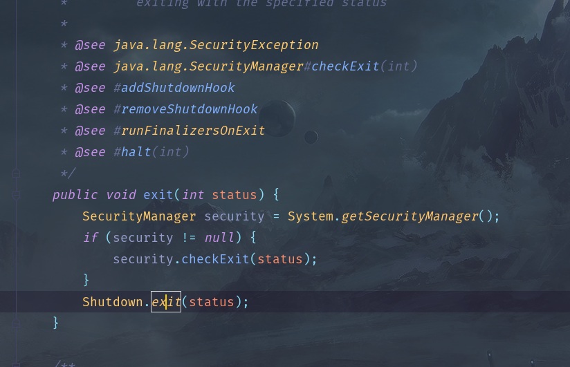
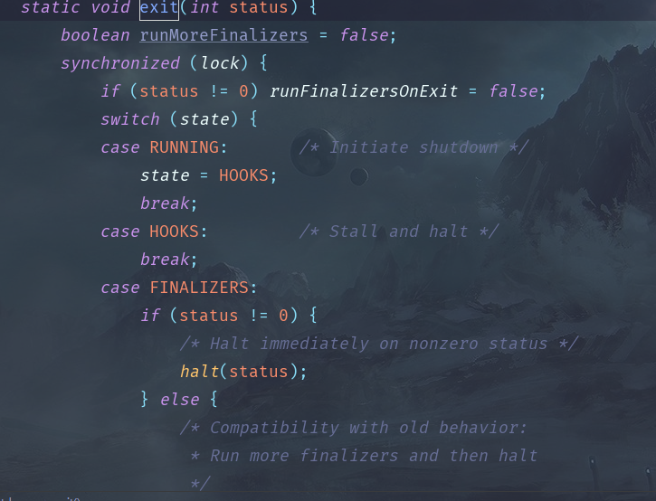
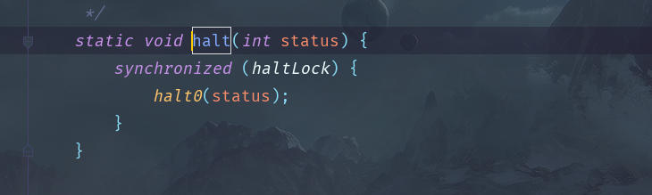

### 虚拟机的结构
#### 栈式架构
设计和实现更简单，适用于资源首先的系统

避开了寄存器的分配难题：使用零地址（零地址就是不需要地址进行操作，由于栈的结构独特性，入栈出栈都是在栈顶操作，所以不需要地址）指令方式分配

指令流中的指令大部分是是零地址指令，其执行过程依赖于操作栈，指令集更小，编译器容易实现

不需要硬件支持，可移植性更好，更好的实现跨平台
##### 寄存器架构
典型的应用是x86的二进制指令集：比如传统的PC以及Android的Davlik虚拟机。

指令集架构则完全依赖于硬件，可移植性差（与硬件的耦合度较高）

性能优秀和执行更高效（因为完全依赖于硬件）

花费更少的指令去完成一项操作  

在大部分情况下，基于寄存器架构的指令集往往都是以一地址指令、二地址指令和 三地址指令为主，而基于栈式架构的指令集确实以零地址指令为主

总结 : 
由于跨平台的设计，Java的指令都是根据栈来设计的。不同平台CPU架构不一样，所以不能设计为基于寄存器的。
优点是**跨平台性吗，指令集小，编译器容易实现**
缺点是性能下降，实现同样的功能需要更多的指令

##

### JVM虚拟机的生命周期

####虚拟机的启动：	

	Java虚拟机的启动是通过引导类加载器(bootstrap class loader)创建一个初始类(initial class)来完成的，这个类是由虚拟机具体实现指定的。

####虚拟机的执行：

	一个运行中的Java虚拟机有着一个清晰的任务：执行Java程序

	程序开始执行时才运行，程序结束时就停止

	执行一个所谓的Java程序时，真真正正是执行一个叫Java虚拟机的进程

####虚拟机的退出：
分为以下这几种情况：

    1、一个Java程序运行完后自动退出
    2、程序出现异常或出现错误
    3、调用了Rumtime类的half方法或System的exit方法，并且Java安全管理器也允许这次exit或half操作
    
    除此之外，JNI（Java Native Interface）规范描述了用JNI Invocation API 来加载或卸载Java虚拟机时，Java虚拟机的退出情况
   
  Runtime类中的exit方法：
   
 
 
 exit方法调用half方法：
 
 
 half方法调用一个halt0方法：
 
 
 
 halt0实际调用一个本地方法接口（JNI）：
  

##

### JVM内存分区
```text
以默认的HOTSPOT为例
```
java8之前:

线程私有:

java虚拟机栈，本地方法栈，程序计数器。

线程公有：

堆区，永久代（方法区的实现）

java8之后：

永久代被移除，新增加了元空间，元空间内保存的是类的元信息，几乎不会发生GC

其他不变

###结构
JVM的内存分区分为两部分：
#### 线程私有：
1) 程序计数器：

   程序计数器是一个块内存极小的空间，是用来记录当前线程字节码执行位置的计数器
    
   当字节码工作时，通过改变计数器内的行号来执行下一步字节码指令 
   
   分支，循环，跳转，异常处理，线程恢复等功能都依赖程序计数器来实现
   
   程序计数器的作用:
   
   程序计数器属于线程私有的部分，即每个线程都有自己独立的程序计数器
   
   当cpu再多个线程之前切换时，程序计数器会记录下当前线程的字节码执行地址
   
   等到cpu下一次执行此线程时，依据这个地址继续往下执行
   
   程序计数器的优点:
   1、内存占比特别小，几乎可以忽略不计
   
   2、是Java虚拟机规范中唯一不会发生OOM(OutofMemeryError)的区域
   
   3、当执行的是Java方法是，程序计数器会记录当前字节码的地址，但是当执行本地方法时，程序计数器记录的地址为null(undified)，事实上本地方法执行的是本地的c/c++库，不是Java规范，所以无法记录
   
   4、程序计数器的生命周期与线程同步，随着线程的创建而创建，随着线程的销毁而销毁
    
2) Java虚拟机栈与本地方法栈：

Java虚拟机栈，都是线程私有的部分， 生命周期也和线程同步。

Java虚拟机栈是Java方法运行时的内存模型

 #####栈帧:
   栈帧是Java方法运行时的数据结构
   
   栈帧包含了局部变量表，操作数栈，动态连接，方法出口
   
   每个方法执行时，都会在Java虚拟机栈中创建一个栈帧，方法的执行与返回的过程，就是栈帧入栈和出栈的过程
   
   在编译时期，每个栈帧中需要多大的局部变量表，需要多大的容量，都是已经规定好的，这取决于Java虚拟机的规范
   
   一个线程中的方法调用链可能会很长，很多方法都同时处于执行状态，对于执行引擎来说，只有在Java虚拟机栈栈顶的栈帧才是有效的，称为当前栈帧(Current Stack Frame)，栈帧所关联的方法称之为当前方法   
   
 ####局部变量表  
 
   局部变量表中存储了方法的参数以及执行过程中所需要的局部变量。局部变量表能存储已知的各种数据类型变量。例如:(byte,short,int,char,long,double,float,boolean)或是引入类型(reference)
   
   局部变量表以slot为最小单位，一个slot为四个字节，也就是32为长度。对于超过32为长度的数据类型，Java虚拟机规范会根据高位补齐的方式，为这个变量分配两个连续的slot，也就是将这个变量拆成两部分进行读写
   
   一般一个slot在栈帧中占1个栈容量，当超过一个slot则占2个栈容量
   
   slot在局部变量表中是可以重用的，当超过的slot的作用范围，下一次分配slot的时候，会覆盖原来的slot，slot对对象的引用会影响GC
   
   局部变量表不会对局部便赋初始值。(局部变量不赋初始值会编译错误)

#####操作数栈：

   操作数栈是一个（LIFO）的一个线性表，用于存方法方法运行时的计算的结果元素，和栈帧一样，栈的容量都是一开始定义好的。
   
   一个方法开始执行时，会创建一个空的操作数栈，当由局部变量初始化或者有进行变量的计算时，就会进行入栈操作，读取计算结果就是出栈操作
   
#####操作数栈的运行原理：
```text
 1 、定义了一个常量2，保存
 istore_1是操作数栈的索引位置
 2 、定义了一个常类3，保存
 istore_2是更新后的操作数栈的索引位置
 3 、iload_1、iload_2 表示分别将索引1和索引2保存的常类加载进来
 4 、iadd 进行相加的指令
 5 、保存为索引3
 6 、返回结果
```


#####动态链接

    首先要知道符号引用和直接引用
    
   符号引用存在于Class常类池中，分为全限定类名，方法名与描述符，字段名与描述符
   
   直接引用就是一个指针，直接指向了该对象在内存中的地址 
##
   在Java虚拟机栈中，每一个栈帧都会有一个所属方法的符号引用，持有这个引用是为了支持方法在调用过程中的动态链接。

   符号引用在jvm的类解析阶段换转为直接引用，这部分转换成静态引用，还有一部分会在运行时转换为直接引用，这部分称为动态连接

####方法出口
 每一个方法在执行时，都有两种方式进行退出
 
 1、 正常退出：
    
   方法在执行过程中执行到return指令，该方法就会正常退出。
 
 2、 异常退出
 
   由jvm内部发生的异常或遇到throw指令，且在该方法的异常表中没有对应的异常处理器，该方法就会异常退出
   
 一般来说，方法在正常退出时，当前程序计数器的值可以当作方法的返回地址，栈帧可能保存程序计数器的值，但是在异常退出时，栈帧不会保存任何的值    
#### 线程公有：

#####堆


#####永久代
