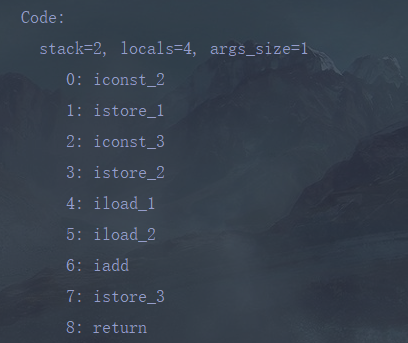

操作数栈：

 1 、定义了一个常量2，保存
 istore_1是操作数栈的索引位置
 2 、定义了一个常类3，保存
 istore_2是更新后的操作数栈的索引位置
 3 、iload_1、iload_2 表示分别将索引1和索引2保存的常类加载进来
 4 、iadd 进行相加的指令
 5 、保存为索引3
 6 、返回结果
 

总结 : 
由于跨平台的设计，Java的指令都是根据栈来设计的。不同平台CPU架构不一样，所以不能设计为基于寄存器的。
优点是**跨平台性吗，指令集小，编译器容易实现**
缺点是性能下降，实现同样的功能需要更多的指令