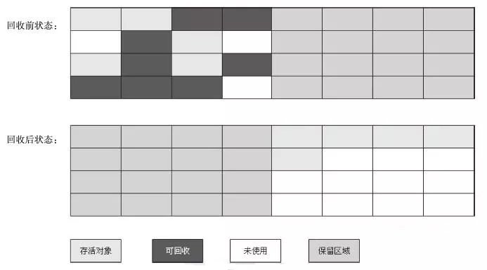

 # JVM虚拟机

## 虚拟机的结构

### 栈式架构
设计和实现更简单，适用于资源首先的系统

避开了寄存器的分配难题：使用零地址（零地址就是不需要地址进行操作，由于栈的结构独特性，入栈出栈都是在栈顶操作，所以不需要地址）指令方式分配

指令流中的指令大部分是是零地址指令，其执行过程依赖于操作栈，指令集更小，编译器容易实现

不需要硬件支持，可移植性更好，更好的实现跨平台
### 寄存器架构
典型的应用是x86的二进制指令集：比如传统的PC以及Android的Davlik虚拟机。

指令集架构则完全依赖于硬件，可移植性差（与硬件的耦合度较高）

性能优秀和执行更高效（因为完全依赖于硬件）

花费更少的指令去完成一项操作  

在大部分情况下，基于寄存器架构的指令集往往都是以一地址指令、二地址指令和 三地址指令为主，而基于栈式架构的指令集确实以零地址指令为主

总结 : 
由于跨平台的设计，Java的指令都是根据栈来设计的。不同平台CPU架构不一样，所以不能设计为基于寄存器的。
优点是**跨平台性吗，指令集小，编译器容易实现**
缺点是性能下降，实现同样的功能需要更多的指令

##

## JVM虚拟机的生命周期

### 虚拟机的启动	

	Java虚拟机的启动是通过引导类加载器(bootstrap class loader)创建一个初始类(initial class)来完成的，这个类是由虚拟机具体实现指定的。

### 虚拟机的执行

	一个运行中的Java虚拟机有着一个清晰的任务：执行Java程序

	程序开始执行时才运行，程序结束时就停止

	执行一个所谓的Java程序时，真真正正是执行一个叫Java虚拟机的进程

### 虚拟机的退出
分为以下这几种情况：

    1、一个Java程序运行完后自动退出
    2、程序出现异常或出现错误
    3、调用了Rumtime类的half方法或System的exit方法，并且Java安全管理器也允许这次exit或half操作
    
    除此之外，JNI（Java Native Interface）规范描述了用JNI Invocation API 来加载或卸载Java虚拟机时，Java虚拟机的退出情况
   
 Runtime类中的exit方法：
   
 
 
 exit方法调用half方法：
 
 
 
 half方法调用一个halt0方法：
 
 
 
 halt0实际调用一个本地方法接口（JNI）：
 
 

##

## JVM内存分区

```text
以默认的HOTSPOT为例
```
### java8之前

线程私有:

### java虚拟机栈，本地方法栈，程序计数器。

线程公有：

堆区，永久代（方法区的实现）

### java8之后

永久代被移除，新增加了元空间，元空间内保存的是类的元信息，几乎不会发生GC

其他不变

## 结构

JVM的内存分区分为两部分：

### 线程私有

#### 1) 程序计数器

   程序计数器是一个块内存极小的空间，是用来记录当前线程字节码执行位置的计数器
    
   当字节码工作时，通过改变计数器内的行号来执行下一步字节码指令 
   
   分支，循环，跳转，异常处理，线程恢复等功能都依赖程序计数器来实现
   
   程序计数器的作用:
   
   程序计数器属于线程私有的部分，即每个线程都有自己独立的程序计数器
   
   当cpu再多个线程之前切换时，程序计数器会记录下当前线程的字节码执行地址
   
   等到cpu下一次执行此线程时，依据这个地址继续往下执行
   
   程序计数器的优点:
   1、内存占比特别小，几乎可以忽略不计
   
   2、是Java虚拟机规范中唯一不会发生OOM(OutofMemeryError)的区域
   
   3、当执行的是Java方法是，程序计数器会记录当前字节码的地址，但是当执行本地方法时，程序计数器记录的地址为null(undified)，事实上本地方法执行的是本地的c/c++库，不是Java规范，所以无法记录
   
   4、程序计数器的生命周期与线程同步，随着线程的创建而创建，随着线程的销毁而销毁
    
#### 2) Java虚拟机栈与本地方法栈：

Java虚拟机栈，都是线程私有的部分， 生命周期也和线程同步。

Java虚拟机栈是Java方法运行时的内存模型,它由一个个**栈帧**组成

#### 栈帧
   栈帧是Java方法运行时的数据结构
   
   栈帧包含了局部变量表，操作数栈，动态连接，方法出口
   
   每个方法执行时，都会在Java虚拟机栈中创建一个栈帧，方法的执行与返回的过程，就是栈帧入栈和出栈的过程
   
   在编译时期，每个栈帧中需要多大的局部变量表，需要多大的容量，都是已经规定好的，这取决于Java虚拟机的规范
   
   一个线程中的方法调用链可能会很长，很多方法都同时处于执行状态，对于执行引擎来说，只有在Java虚拟机栈栈顶的栈帧才是有效的，称为当前栈帧(Current Stack Frame)，栈帧所关联的方法称之为当前方法   
   
#### 局部变量表  
 
   局部变量表中存储了方法的参数以及执行过程中所需要的局部变量。局部变量表能存储已知的各种数据类型变量。例如:(byte,short,int,char,long,double,float,boolean)或是引入类型(reference)
   
   局部变量表以slot为最小单位，一个slot为四个字节，也就是32为长度。对于超过32为长度的数据类型，Java虚拟机规范会根据高位补齐的方式，为这个变量分配两个连续的slot，也就是将这个变量拆成两部分进行读写
   
   一般一个slot在栈帧中占1个栈容量，当超过一个slot则占2个栈容量
   
   slot在局部变量表中是可以重用的，当超过的slot的作用范围，下一次分配slot的时候，会覆盖原来的slot，slot对对象的引用会影响GC
   
   局部变量表不会对局部便赋初始值。(局部变量不赋初始值会编译错误)

#### 操作数栈

   操作数栈是一个（LIFO）的一个线性表，用于存方法方法运行时的计算的结果元素，和栈帧一样，栈的容量都是一开始定义好的。
   
   一个方法开始执行时，会创建一个空的操作数栈，当由局部变量初始化或者有进行变量的计算时，就会进行入栈操作，读取计算结果就是出栈操作
   
#### 操作数栈的运行原理

```text
 1 、定义了一个常量2，保存
 istore_1是操作数栈的索引位置
 2 、定义了一个常类3，保存
 istore_2是更新后的操作数栈的索引位置
 3 、iload_1、iload_2 表示分别将索引1和索引2保存的常类加载进来
 4 、iadd 进行相加的指令
 5 、保存为索引3
 6 、返回结果
```


#### 动态链接

    首先要知道符号引用和直接引用
    
   符号引用存在于Class常类池中，分为全限定类名，方法名与描述符，字段名与描述符
   
   直接引用就是一个指针，直接指向了该对象在内存中的地址 
##
   在Java虚拟机栈中，每一个栈帧都会有一个所属方法的符号引用，持有这个引用是为了支持方法在调用过程中的动态链接。

   符号引用在jvm的类解析阶段换转为直接引用，这部分转换成静态引用，还有一部分会在运行时转换为直接引用，这部分称为动态连接

#### 方法出口
 每一个方法在执行时，都有两种方式进行退出
 
 1、 正常退出：
    
   方法在执行过程中执行到return指令，该方法就会正常退出。
 
 2、 异常退出
 
   由jvm内部发生的异常或遇到throw指令，且在该方法的异常表中没有对应的异常处理器，该方法就会异常退出
   
 一般来说，方法在正常退出时，当前程序计数器的值可以当作方法的返回地址，栈帧可能保存程序计数器的值，但是在异常退出时，栈帧不会保存任何的值   
 
### 线程公有

#### 堆

  **堆是Java虚拟机中内存最大的一块区域，是属于线程公有的一部分。它的作用是为对象分配内存并收集他们，在堆中很容易发生GC(垃圾回收，所以堆也称为GC堆**
  
  ##### 堆的内存分配
   
 > 在堆中可以分为年轻代(Yong Generation)，老年代(Old Generation)和永久代(Permanent Generation,Java8之后被替换为元空间)
 
 > 其中年轻代又有Eden(生成区)和Survivor(存活区)组成，Survivor区又由FromSpace和ToSpace组成。Eden占大容量，Survivor区的两个区占小容量，默认是8：1：1
 
  ##### 分代情况
  
 > 年轻代中存放着JVM为刚分配出来的对象，老年中存放着从年轻代中copy过来的对象，一般是> 经过多次Minor GC(Yong GC) 仍然存活的对象。
 > 元空间存放着Class、Method的元信息 
  
  可以通过两个参数来设置元空间的内存情况：
  
 **MetaspaceSize ：初始化元空间大小，控制发生GC阈值
  MaxMetaspaceSize ： 限制元空间大小上限，防止异常占用过多物理内存**

  ##### 分代概念
 
 **将对象根据存活概率进行分配，对存活时间长的效率，放到固定区，减少垃圾扫描时间与GC频率**  
 
  ##### 分代的过程
  
 > 当我们需要创建一个对象时,JVM会为这个对象申请内存区域
 > 首先对新生代进行判断，如果此时新生代的空间不足，将会进行一次Minor GC(Yong GC)
 > 如果GC后空间足够，产生对象，反之，判断存活区的空间是否足够。
   
 > 如果存活区的空间足够，将此时生成区存活的一部分对象copy到存活区。
 > 反之，判断老年代的内存是否足够，足够就将存活区的一部分对象copy到老年代中，
 > 如果此时老年区也满了，就会触发一次Old GC(Major GC)，对老年进行清理
 > 如果GC后空间仍然不够，就会抛出OOM错误       

	PS: 有些文章说Major GC = Full GC，是对整个堆的分区进行清理，这个还请读者自行判断。
	
#### 方法区:永久代/元空间
    
   **方法区也是线程公有的一块区域，用于存放已被JVM加载的类的元信息，已经运行时常量池等数据**
   
   ##### 关于永久代与方法区
   
 > 在Java8之前，方法区的实现是永久代，永久代占用的是JVM的内存
 > Java8之后，永久代被删除，新增了元空间，元空间引用的是本地物理内存，所以元空间
 > 属于非堆内存，元空间内存储着已被加载的类的方法描述，字段描述，运行时常量池等信息,几> 乎不会发生GC，但依然会发生OOM错误
 
   ##### 为什么要删除永久代，新增元空间
   
   **为了统一虚拟机之间的规范，JRocket VM(新的JVM技术)没有永久代**
   
### JavaVirtualMachineError

   #### 为什么会出现堆内存溢出

	在年轻代中的经过多次GC后还存活着的对象会被复制到老年代中。当老年代空间不足时，
	JVM会对堆区进行 Full GC，如果Full GC 之后老年代的空间还是不足时，就会出现OOM。
	
   #### StackOverflowError
   
   **当前线程执行或请求的栈的大小超过了Java虚拟机栈的最大容量**
   
   **比如无限递归等，都会产生StackOverflowError**     
   
   #### OutOfMemoryError
   
   产生OOM的情况：
    
  *  Java Heap Space
  > 老年代内存不足,新生代的存活对象无法复制到老年代，就会发生
  > OOM :Java Heap Space
    
  *  GC Overhead Limit Exceed
  > 当垃圾回收器花费很长时间进行GC,但是回收的内存非常少的时候，可能出现
  > OOM :GC Overhead Limit Exceed
  
  *  Direct Buffer Memory
  > 当程序分配了超额的本地内存(native memory/ direct buffer)
  > 但是Minor GC 并不会回收这一部分内存，只有Full GC会进行回收
  > 如果没有产生Full GC 而这一部分内存又被使用完了，就可能发生
  > OOM :Direct Buffer Memory
  
  *  Unable To Create New Native Thread
  > CPU分配的线程资源是有限的，当程序尝试产生很多的线程，就有可能发生
  > OOM :Unable To Create New Native Thread
  
  *  MetaSpace
  > 元空间内存放的元信息太多，就可能会产生
  > OOM :MetaSpace
    

## 类的生命周期
 一个类的生命周期可以分为一下几部分
 
 > 加载->连接->初始化->使用->卸载
 
 其中连接又可以分为以下几部分
 
 > 验证->准备->解析
 
### 加载
  
  **在加载阶段，类加载器将class文件以二进制流的方式读入进方法区，并在堆中创建该class文件的对象**
  
  #### 加载的方式：
   
   * 从磁盘读取，当java文件被编译为.class文件后，jvm会将生成的.class文件从磁盘读取
   * 从.zip、.jar等压缩文件读取
   * 从网络流中读取类的字节流
   * 通过动态生成的字节码技术(cglib、动态代理等)
   
### 连接
    
   连接分为三个部分:
   
   #### 验证
   
   > 为了确保类的字节流是否符合虚拟机规范，并且不会对虚拟机进行恶意损坏。通常会进行如下验证：
   
   * 文件格式验证：会验证class文件是否符合虚拟机规范，比如是否以0xcafetbabe开头，主次版本号是否在虚拟机范围内，常量池中是否有虚拟机不支持的类型
   * 元数据验证：会对类的元信息进行语义分析，确保符合Java语法规范
   * 字节码验证: 通过分析数据流和控制流，确保方法体程序语义是合法的，符合逻辑的。
   * 符号引用验证：确保在常量池中的符号引用能在解析阶段正常解析
   
   #### 准备
   
   > 对常量池中的属性进行初始化(0,false,null)
   
   #### 解析
   
   > 将常量池中的一部分符号引用转变为直接引用
   
### 初始化    

> 初始化是类加载过程中的最后一个阶段

 在这个阶段，只有主动使用类才会初始化类，总共有8种情况会初始化类
 
   1、当jvm执行new指令的时就会初始化类。即当程序尝试创建一个对象。
   
   2、当jvm执行getstatic指令时就会初始化类。即当程序尝试获取类的一个静态变量。
   
   3、当jvm执行putstatic指令时就会初始化类。即当程序尝试对一个类的静态变量赋值。
   
   4、当jvm执行invokestatic指令时就会初始化类。即当程序尝试调用一个类的静态方法。
   
   5、当使用反射主动调用这个类时，就会初始化这个类。如Class.forname("..."),newInstance()等等。
   
   6、当初始化一个子类时，会先初始化这个类的父类，然后才去初始化这个类。
   
   7、当一个类是**启动类**时，即这个类拥有main方法，那么jvm会优先初始化这个类。
   
   8、MethodHandle和VarHandle可以看作是轻量级的反射调用机制，而要想使用这2个调用， 就必须先使用findStatic/findStaticVarHandle来初始化要调用的类。
   
 ### 使用
 
  > 当一个类初始化完毕后，就可以使用这个类了  
  
 ### 卸载
 
  > 类的卸载（被GC回收掉）需要满足3个条件 
  
  1、这个类的类加载器已被GC回收掉
  
  2、这个类没有在其他地方被引用
  
  3、这个类的实例对象已被GC，即在堆中不存在这个类的实例对象
  
  在JVM的生命周期中，JVM自带的类加载器是不会被GC的，而我们自定义的类加载器是会被GC的
  
  >也就是说，jdk自带的BootstrapClassLoader,PlatformClassLoader和AppClassLoader负责加载jdk提供的类 
  > ，它们(类加载器)的实例肯定不会被回收，其中BootstrapClassLoader由于是c/c++编写的，在java中获取不到。
  > 而我们自定义的类的类加载器实例是可以被GC回收的，所以被我们自定义类的加载器加载的类是可以被GC掉的。
  
 ### 类加载器
 
#### 类加载的种类：
 
1、 BootstrapClassLoader(用于加载Java核心类库。由c/c++编写，在Java中无法获取)

2、 PlatformClassLoader(jdk9之后才有此类加载器，dk8之前是扩展加载器ExtensionClassLoader
。PlatformClassLoader加载平台相关的模块，ExtensionClassLoader加载jdk扩展的模块)

3、AppClassLoader。（应用程序加载，负责加载程序的classpath下的jar和类）

#### 类加载器的命名空间

每个类加载器实例都有自己的命名空间，命名空间由该加载器及其所有父加载器加载的所有的类组成。 在**同一个类加载器实例**中
(同一个命名空间内)，不会出现全限定名(包括包名)相同的2个类(不会加载2个相同名称的类)。 在不同的命名空间中(多个
类加载器实例)，可能会出现全限定名(包括包名)相同的2个类(可能加载2个相同名称的类)。

4、自定义类加载器

 ### 双亲委派机制
 
 > 每一个类都有一个对象的类加载器
 
 #### 为什么需要双亲委派机制 
   双亲委派机制是为了防止重复加载类，避免核心API遭到破坏。如Object类，它由BootstrapClassLoader在JVM启动时加载，如果没有双亲委派机制，那么Object将可以被重写，这是一件很可怕的事情。
   
 #### 双亲委派机制的实现原理
 
   双亲委派机制是指在加载一个类的时候，首先检查这个类是否已经被其类加载器所加载了，如果有，就直接返回这个类的实例对象。
   如果没有加载，就使用这个类对应加载器的父类加载器进行判断，一层层网上判断，最终会由BootstrapClassLoader进行判断。如果BootstrapClassLoader判断这个类没有加载，那么就有BootstrapClassLoader和它的子类加载器进行加载。
   
   
   
## JVM常量池

    Jvm常量池分为 Class文件常量池，运行时常量池，字符串常量池和包装类型常量池。
       
### Class文件常量池(静态常量池) 
  
  当Class文件被编译后，就会生成Class字节码文件，Class文件常量池就存放在Class字节码文件中(Class文件的 Constant Pool中)。
  
  Class文件常量池主要存放两大常量：字面量与符号引用
  
#### 字面量
   字面量分为文本字符串和用final修饰的成员变量
   
#### 符号引用
    
   符号引用分为方法的全限定类名，方法名与描述符和字段名与描述符      

### 运行时常量池
   运行时常量池就是当Class文件被类加载器加载进内存后，所产生的二进制流数据被保存进方法区，其中Class文件常量池保存在运行时常量池(方法区中)，也就是说一个Class文件常量池对应一个运行时常量池。

### 字符串常量池(全局常量池) 
 
  顾名思义，就是存储字符串常量的地方，当你想创建一个String的对象，jvm会先检查常量池中有没有你想创建的字符串对象，如果有就直接返回引用，没有则新创建一个字符串对象。
  
  jdk1.7以前，存在于方法区（永久代中），jdk1.8之后，永久代被替换为了元空间，所以常量池转移到了堆区中(heap)
  
  补充：
  
  字符串对象内部是由一个final的字符数组组成的。
  
  所有对同一个字符串对象的引用都是引用同一个字符数组，那么为什么
  
  String s = "Hello" 与 String s2 = new String("Hello") 不是同一个对象呢？
  
  答：虽然都是在引用字符串常量池中的同一个字符串对象，但是，由于s2多创建了一个String对象，相当于在堆中创建了一个String对象去引用常量池中的字符串对象，而s是直接引用。
  
 ### 包装类型缓存池
 
  包装类型缓存池，顾名思义，就是缓存包装类型的变量，但不是所有的包装类型都有，并且缓存的是一定范围内的数据。拥有包装类型缓存池的类型有Integer,Byte,Character,Long,Short,而Float，Double，Boolean都不具有缓存池。
  
  包装类型的缓存池的范围基本为:-128 ~ 127 之间，Character的缓存范围在0 ~ 127之间
  

## GC

### 判断对象存活的方法(引用计数，可达性)
   
   #### 引用计数
   
   给每个对象都添加一个计数器，这个对象每被另外一个对象引用一次，计数器+1，反之-1，如果计数器的值在一段时间内为0时，代表这个对象可以被GC了。
   
   #### 引用计数的缺点
   假设有两个对象，对象A和对象B，他们之间互相引用，引用计数器的值则永远为1了，这样这两个对象无法被回收。
   
   
   
   #### 可达性算法
   
   可达性算法就是通过一个GC Roots作为起点，通过起点向下遍历，经过的路径作为引用链，并判断引用链包含的对象作为可达性对象，那么不可达的对象将会被回收。
   
   
   
   #### GC Roots
   
   ##### 什么样的对象可以作为GC Roots：
   
   1、Java虚拟机栈或本地方法栈引用的对象
   
   2、方法中静态属性引用的对象
   
   3、方法去中常量引用的对象
 
 ### GC 算法
    常见的GC算法:
    	分代收集算法
    	复制算法
    	标记-清除算法
    	标记-整理算法
    
  #### 分代收集算法
   分代收集算法并不是指某一个具体的算法，而是将复制，标记-清除，标记-整理等算法合理应用到堆区内的不同空间。
   
   在现在JVM中，往往是综合使用的，每个算法都有自己的优缺点，结合他们的特点，不同环境采用不同的算法，才是最明智的。
   
  #### 复制算法
  
   每次将内存分为两块同等大小的内存空间，每次**只使用**一块内存空间，当这块内存空间已经满了，就将仍然存活的对象复制到另外一般内存中，然后情况原来使用的那块内存。
   
   
   
   ##### 复制算法的优缺点
   
       优点：
         清理后不会产生内存碎片
         速度比较高效
       
       缺点：
          每次只使用一半的内存空间，说明可以使用的内存空间减少一半，代价比较高昂
          
   ##### 应用范围
        
        复制算法一般运用于新生代，新生代的GC发生比较频繁，存活的对象较少，每次复制只复制少量存活的对象       
  
  #### 标记-清除算法
  
   >标记复制算法可以分为两部分：标记和清除
   
   ##### 标记
    
   对整个内存区域进行扫描，标记处存活的对象。
   
   ##### 清除
   
   标记完成之后，立即清除没有被标记的对象。
   
   ##### 标记-清除算法的缺点
   
   * 标记和清除两个时间比较长
   * 由于对象在内存空间中可能是不连续存在的，在进行标记-清除后，可能会留下大量
     不连续的内存碎片，这些内存碎片也会占据内存空间，所以当内存碎片过多时，想要
     分配一个比较大的内存对象，就需要再次进行一次GC。
     
    PS: 标记-清除算法和标记-整理算法一样，一般用于老年代，因为老年代中存活的对象比较多，比较不容易触发GC，所以标记-清除和标记-整理的时间不会太长。   
    
       
   
  #### 标记-整理
   
    标记-整理算法是对象标记-清除算法的一种改进
    
  一开始都是先标记存活的对象，但是标记结束后不会立即回收对象，而是对象存活的对象进行整理
  
  将存活的对象移动到内存的一端，然后清理另一端的内存空间。 
  
   ##### 标记-整理算法的优缺点
     优点：
         由于每次标记后都会对存活的对象进行整理，然后再清理其他的内存空间，这样大概率上不会和标记-清理算法一样，留下一大堆的内存碎片。
     缺点：
         虽然不会留下内存碎片了，但是增加了对对象进行整理的时间。
   
             

  ### 内存分配与垃圾回收策略
   
   #### GC过程
    下图引用自阿里出品的《码出高效 - Java开发手册》，很明了的诠释了GC的主要过程
    
     
    
 > 我们知道，对象首先在新生代(eden)中，而eden区又分为了生成区和存活区(survivor),
 > survivor区又分为了fromSurvivor和toSurvivor两个区
 
 > 一开始，对象先分配在eden中，fromSurvivor与toSurvivor几乎是空着的。
 > 随着时间的运行，越来越多的对象被分配到eden中。当eden放不下时，就会发生
 > Minor GC(Yong GC),当然首先由JVM用可达性算法标记出存活的对象，然后将
 > 可达对象移动到fromSurvivor中，再清理不可达的对象。经过一轮GC后，
 > eden此时几乎是空的了
 
    PS: 这里实际上就运用了标记-清理算法与复制算法
    
 > 经过一段时间后，eden区又满了，重复上面操作，只不过，是将eden与fromSurvivor中的对象移动到toSurvivor(此时toSurvivor变成了fromSurvivor,fromSurvivor变成了toSurvivor,这两个区是会互相转换的。)   
 > 但是经过了时间的推移，eden区又满了，还是重复上面的操作，但是这样一直在两个区之间
 > 移动来移动区不是法子呀,效率低不说，还占空间，那么要怎么样解决呢，于是就有了**晋升阈值**
 
    晋升阈值：对象在年轻代的3个区之间移动，每移动一次，年龄就+1，当对象年龄达到一定阈值时，晋升至老年代。
    第一次默认为15，可以通过-XX:MaxTenuringThreshold设置最大的阈值)   
    
 > 对象晋升至老年代了，如果老年代也满了，就会发生Major GC，由于老年代的对象t通常会比较多,
 > 标记-整理的耗时通常比较长，这样会造成应用程序卡顿，这也是为什么很多应用需要优化
 > 尽量避免和减少Major GC的原因   
 
   #### 动态年龄阈值 
   
   JVM并不要求所有的对象年龄一定需要达到MaxTenuringThreshold 才可以晋升到老年代，这个阈值时动态计算的。
   
   如果在survivor区中的某个年龄阶段的所有对象的大小之和大于等于survivor的一半，那么只要大于这个年龄的所有对象，就可以进入老年代。
   
### 垃圾收集器
   
   #### Serial 串行收集器  
   
   单线程环境设计，只是用一个线程来进行回收。当Serial回收器进行回收时，会暂停用户线程(Stop The World,检查STW)，所以并不使用在多线程环境。
   
   但是Serial回收器在单线程环境下的效率还是很高效的，没有多线程带来的开销。
   
   Serial收集器使用的是复制算法
   
   PS： 目前，只有Serial和ParNew收集器能与CMS收集器搭配使用。、
   
   #### Serial Old 串行收集器(老年代版本)
   
   Serial Old 是Serial回收器的一个老年代版本，使用的是标记-整理算法
   
   #### ParNew 串行收集器(多线程版本)
   
   是Serial收集器的多线程版本，主要功能和Serial收集器差不多，同样也是使用复制算法。
   
   #### Parallel Scavenge(并行收集器)
   
   Parallel Scavenge收集器是并行收集器，它使用多线程进行垃圾回收，但回收时，仍需要暂停用户线程(STW),ParNew 的升级版。
   
   主要区别在于提供了两个参数：-XX:MaxGCPauseMillis 最大垃圾回收停顿时间；
   
   -XX:GCTimeRatio 垃圾回收时间与总时间占比，通过这 2 个参数，可以适当控制回收的节奏，更关注于吞吐率，即总时间与垃圾回收时间的比例。
   
   	吞吐量 = 应用程序代码运行时间/(应用程序代码运行时间+GC时间)
   
   	Parallel Scavenge 回收器使用的是复制算法。
   	
   #### Parallel Old(并行收集器老年代版本)
   	
   Parallel Scavenge回收器的老年代版本，使用的是标记-整理算法。
   
   #### CMS(Concurrent Mark Sweep)
   
   CMS收集器是一款运用在老年代的垃圾收集器，以达到最短停顿时间为目标的收集器，CMS在垃圾回收的过程中，用户线程可以一起运行，无须暂停。
   
   CMS收集器使用的是标记-清除算法，所以在收集过程中可能会产生不连续的内存碎片
   
   ##### CMS的收集过程
   
   1、初始标记
   
   初始标记只会标记与GC Roots有关联的对象
   
   2、并发标记：
   
   并发标记是在对初始标记的对象进行tracing，标记所有可达的对象
   
   3、重写标记
   
   在并发标记阶段，可能由于用户线程的执行， 被被标记对象的引用可能会发生改变，所以此阶段是对已标记的对象重写标记并调整
   
   4、并发清除
   
   标记结束后对未被标记的对象进行清除
   
  #### G1收集器
  
   G1收集器是目前最前沿的垃圾收集器，它是一款面向服务端的收集器，G1收集器无须搭配其他收集器就可以管理整个heap内存，从jdk9开始，G1成为默认的垃圾收集器。
   
   ##### G1收集器的主要特点
   
   1、并行与并发
   
   G1收集器充分利用多核cpu的特点，使用户线程和垃圾回收同时进行
   
   2、可预测的时间模型
   
   降低GC停顿时间是G1与CMS的共同目标，但除了降低停顿时间，G1收集器还能够间理可以预测的停顿时间模型
   
   3、空间整合
     
   G1将heap内存区，划分为一个个大小相等(1-32M,2的n次方)、内存连续的Region区域。
   
   每个region区域都对应Eden、Survivor、Old、Humongous四种角色之一，但是region与region之间不要求连续。
    
    PS:Humongous，简称H区是专门存放超大对象的区域，通常>=1/2Region Size，且只有Full GC阶段，才会回收H区，避免了频繁扫描、复制/移动大对象。
    
   ##### G1收集器的原理
   
   1、初始标记
   
   和CMS一样，只标记和GC Roots有关联的对象
   
   2、并发标记
   
   此过程和CMS一样
   
   3、最终标记
   
   此过程会发生STW，在并发标记阶段，由于程序的执行，可能造成被标记对象之间的引用关系发生变化，最终标记就是对这些对象进行重新标记整理。
   
   4、筛选回收
   
   不同于CMS，G1收集器并不会立即回收所有未被标记的对象，而是根据Region的回收价值和回收成本进行排序，然后再进行回收，这样可以保证在有限的时间内获得最大的回收率。
   
   G1的场景通常是大内存，比如64G甚至更大，为了提高扫描根对象的效率喝标记的效率，G1使用了两个新的辅助存储结构：
   
   ##### 拓展
   
   	G1的场景通常是大内存，比如64G甚至更大，为了提高扫描根对象的效率喝标记的效率，G1使用了两个新的辅助存储结构：
    
    Remembered Sets : 检查 RSets，用于根据每个region里的对象，是从哪指向过来的(即:谁引用了我)，每个Region都有独立的RSets。
    
    Collection Sets ：简称 CSets，记录了等待回收的 Region 集合，GC 时这些 Region 中的对象会被回收（copied or moved）。
    
### JVM调优参数

 #### 堆栈相关
  
  **-Xss?** 
  
    设置线程栈大小
  
  **-Xms?** 
  
    设置堆大小
  
  **-Xmx? / -XX:MaxHeapSize=?** 
  
    设置堆的最大值
  
  **-Xmn? / -XX:NewSize=?** 
  
    设置新生代大小
  
  **-XX:NewRatio=?**  
  
    设置新生代和老年代的占比置,比如-XX:NewRatio=5 老年代:新生代 = 5:1
  
  **-XX:SurvivorRatio=?**  
  
    设置eden区和survivor区的占比，比如-XX:SurvivorRatio=2
    那么 eden:fromSurvivor:toSurvivor = 2:1:1
    
  **-XX:MetaspaceSize=? / -XX:PermGen=?**  
  
    -XX:MetaspaceSize=？：设置元空间大小，适用于jdk8及以后
    -XX:PermGen=? : 设置永久代大小，使用与jdk8以前
    
  **-XX:MaxMetaspaceSize=? / -XX:MaxPermGen=?**  
    
    -XX:MaxMetaspaceSize=?,设置元空间最大值,适用于jdk8及以后
    -XX:MaxPermGen=?，设置永久代最大值，使用与jdk8以前
    
  **-XX:+HeapDumpOnOutOfMemoryError / -XX:HeapDumpPath=?**  
  
    -XX:+HeapDumpOnOutOfMemoryError: 在发生OOM时，dump错误堆栈。
    -XX:HeapDumpPath=/home/logs:在发生OOM时，将堆栈信息dump到指定目录或文件。此参数只有开启 -XX:+DumpHeapOnOutOfMemoryError 才有效
    
 #### GC相关
 
  **-XX:+PrintGCDetails / -Xlog:GC✳**
  
    打印GC日志， -Xlog:GC*在jdk11版本开始推荐使用
    
  **-XX:+TraceClassUnloading / -Xlog:class+unload=info**  
  
    打印类卸载日志，Xlog:class+unload=info在jdk11版本开始推荐使用
    
  **-XX:+UseSerialGC**
    
    使用串行收集器
    
  **-XX:+UseParallelGC**
  
    使用吞吐量收集器Parallel Scavenge   
    
  **-XX:ParallelGCThreads=?**  
    
    设置并行收集器的线程数量
    
  **-XX:+UseConcMarkSweepGC**
  
    使用ParNew收集器/CMS收集器，新生代默认使用ParNew收集器，可以通过加参数 -XX:+UseSerialGC 来改变新生代的收集器为Serial
    
  **-XX:+UseG1GC**
  
    使用G1收集器，jdk9以后是默认属性，无需设置
    
  **-XX:MaxTenuringThreshold=?**      
    
    设置新生代晋升老年的最大年龄阈值
    
  #### 其他
  
  **-server / -client**
  
    使用服务端模式/客户端模式:
    -client:以客户端模式运行应用，client模式适用于客户端桌面应用程序。JVM在此模式下会对客户端程序运行做很大优化。
    
    -server:以服务端模式运行应用，server模式适用于服务端应用程序。JVM在此模式下会对服务端的运行效率做很大优化。   
    
### JVM调优工具

  #### jps(important)
  
    jps用于查看当前系统运行的java进程。
    
    jps -q 查看当前运行中的java进程
    jps -v 打印当前运行中的java进行的jvm参数
    jps -l 打印当前运行中的java进行的详细路径
    jps -m 打印当前运行中的java进程主函数(main方法)的参数        
    
  #### jstat
  
    jstat用于查看java进程的运行状态
    
    jstat -class pid 用于查看java进程类的情况
    jstat -compiler pid 用于查看java进程编译的情况
    jstat -gc pid 用于查看java进程gc的情况
    
  #### jinfo
  
    jinfo用于查看java进程的jvm参数
    
    jinfo -flag MetaspaceSize pid : 查看java进程的jvm的元空间大小
    jinfo -flag MaxHeapSize pid : 查看java进程的jvm的最大堆的大小
    
  #### jstack
  
    jstack用于分析java线程栈信息
    
    jstack pid
  
  #### jmap
  
    jmap既可以给java程序保存快照，也可以查看对象的统计信息
    
    jmap -heap pid 查看java进程堆的信息
    jmap -histo pid 查看java进程对象的信息
    jmap -dump:file=filename pid 生成 java进程jvm的堆快照到指定文件 
  
  #### jconsole(important)   
  
    jvm的可视化工具，结合上面所有功能